# ChatGPT接入企业微信、飞书
## 1.效果预览(图片打不开请科学上网)
- 企业微信 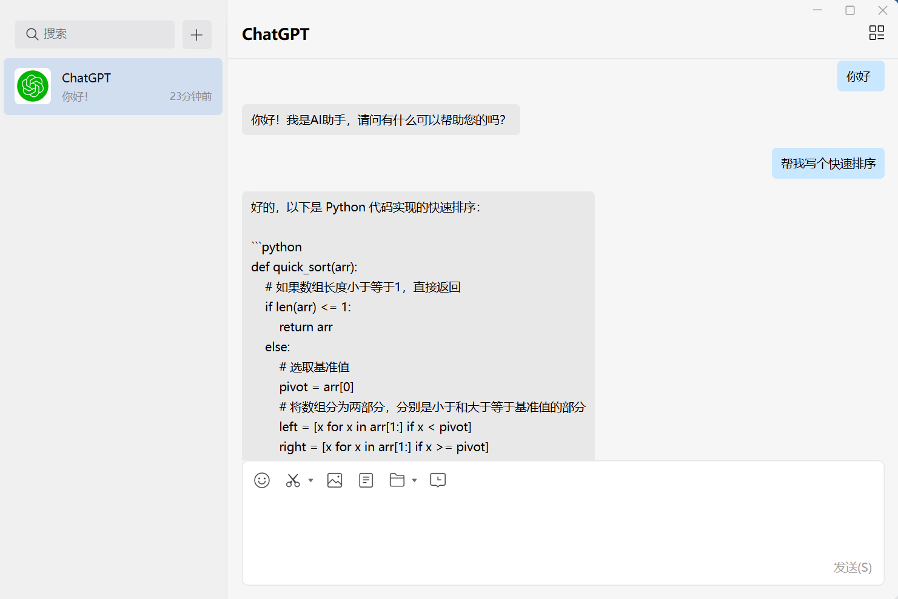
- 飞书 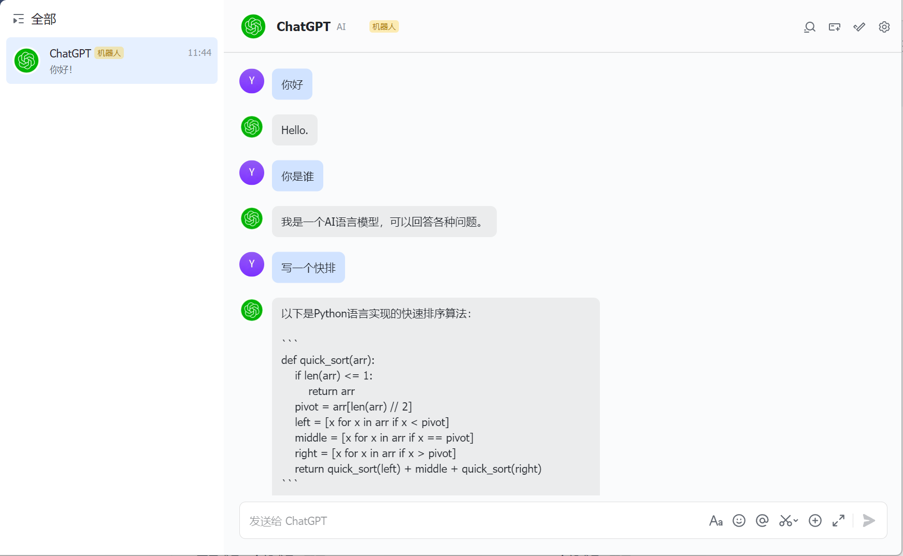
## 2.准备工作
- 一台国外的服务器（本人使用的是阿里云购买的美国服务器）
- 一个域名
- ChatGPT账号
- 具备管理员权限的飞书账号
- 具备管理员权限的企业微信账号
## 3.服务器环境
- jdk1.8
- nginx(本人使用6060端口运行项目，需要nginx监听80，将请求转发到 localhost:6060 并修改nginx配置文件如图所示：
 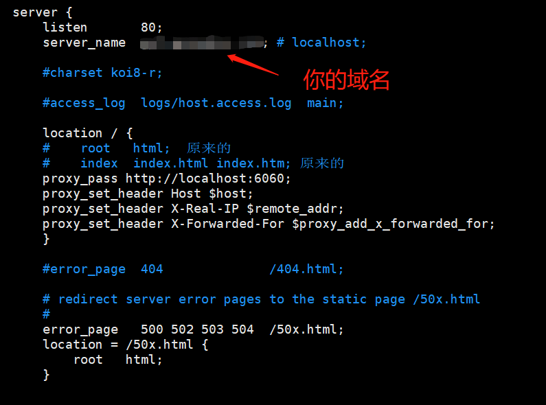
## 4.企业微信

### 4.1 企业微信配置
- 登录企业微信管理后台 ：https://work.weixin.qq.com/wework_admin/frame#apps
- 点击应用管理-->应用-->创建自建应用 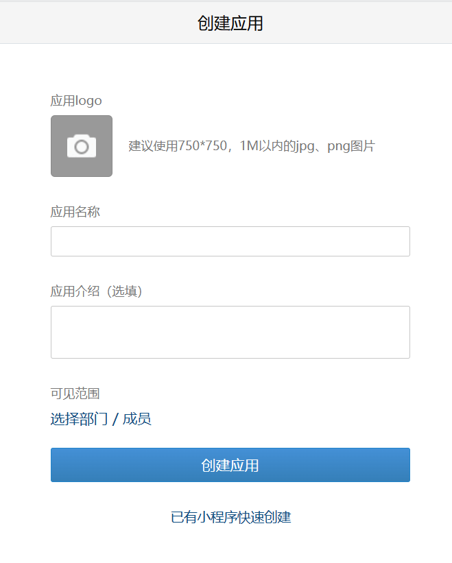
- 点击创建好的应用，配置企业可信IP 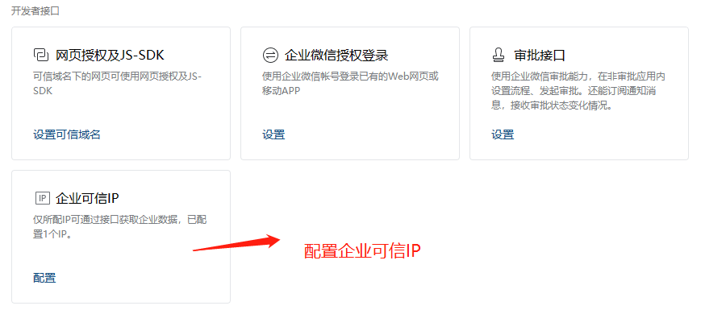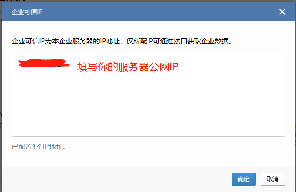
- 配置API接收地址(这里需要先在服务器上运行项目)， 企业微信会发送Get请求到你填写好的URL进行验证
  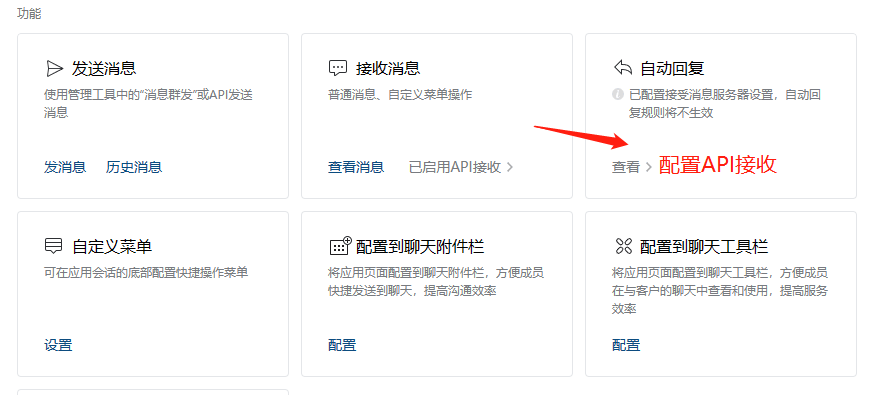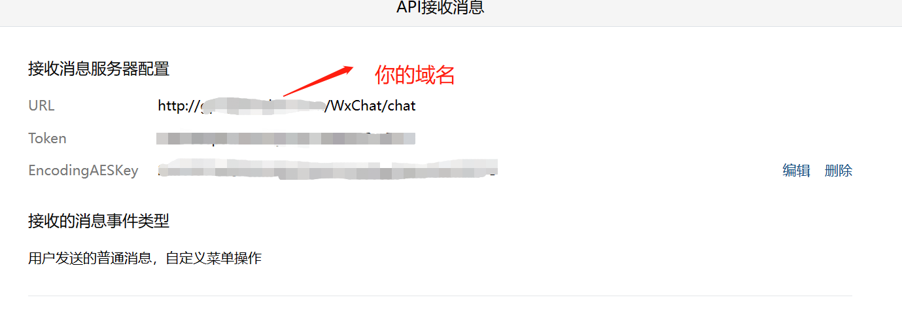

- 记录以下参数
    - Token  ----对应BaseConstants中的WxToken----  在API接收消息页面
    - EncodingAESKey  ----对应BaseConstants中的WxEncodingAESKey----  在API接收消息页面
    - Agentid  ----对应BaseConstants中的WxAgentID---- 在你创建应用的配置页面
    - Secret   ----对应BaseConstants中的WxCorpSecret---- 在你创建应用的配置页面
    - CorpId   ----对应BaseConstants中的WxCorpID---- 在我的企业-->企业信息-->企业ID

### 4.2 代码介绍
- WxGPTController  参考文档 :[接收消息](https://developer.work.weixin.qq.com/document/10514)
  ```java
  /**
   * 用于企业微信验证接受消息的Url是否可用
   */
   @GetMapping("/chat")
   private String verify(@RequestParam("msg_signature") String msg_signature,
                         @RequestParam("timestamp") String timestamp,
                         @RequestParam("nonce") String nonce,
                         @RequestParam("echostr") String echostr) throws Exception {
       log.info("chat, msg_signature:{}, timestamp:{}, nonce:{}, echostr:{}",
               msg_signature, timestamp, nonce, echostr);
       //企业微信给的工具包，内部封装了签名验证、解密、加密等方法(本项目保存在util.wx包下)
       WXBizMsgCrypt wxcpt = new WXBizMsgCrypt(BaseConstants.WxToken, BaseConstants.WxEncodingAESKey, BaseConstants.WxCorpID);
       try {
           String sEchoStr = wxcpt.VerifyURL(msg_signature, timestamp,
                   nonce, echostr);
           log.info("verifyurl echostr: " + sEchoStr);

           return sEchoStr;
       } catch (Exception e) {
           //验证URL失败，错误原因请查看异常
           log.error("verifyurl error,e={}", e);
           return "";
       }
   }
   ```
   ```java
   /**
    * 用户像自建应用发送消息时，企业微信会把消息封装成xml的格式，请求该Url
    */
    @PostMapping(value = "/chat",
           consumes = {"application/xml", "text/xml"},
           produces = "application/xml;charset=utf-8")
   private String chat(@RequestParam("msg_signature") String msg_signature,
                       @RequestParam("timestamp") String timestamp,
                       @RequestParam("nonce") String nonce,
                       @RequestBody String WxUserSendMsg) throws Exception {

       log.info("------企微------:chat方法被调用");

       //签名验证、解密
       WXBizMsgCrypt wxcpt = new WXBizMsgCrypt(BaseConstants.WxToken, BaseConstants.WxEncodingAESKey, BaseConstants.WxCorpID);
       //解析消息内容
       String xmlcontent = wxcpt.DecryptMsg(msg_signature, timestamp, nonce, WxUserSendMsg);

       String content = StringUtils.substringBetween(xmlcontent, "<Content><![CDATA[", "]]></Content>");
       String user = StringUtils.substringBetween(xmlcontent, "<FromUserName><![CDATA[", "]]></FromUserName>");

       //防止重复请求 
       //微信开发文档中有这样一句话：企业微信服务器在五秒内收不到响应会断掉连接，并且重新发起请求，总共重试三次。如果企业在调试中，发现成员无法收到被动回复的消息，可以检查是否消息处理超时。关于重试的消息排重，有msgid的消息推荐使用msgid排重。事件类型消息推荐使用FromUserName + CreateTime排重。 调用chatgpt的api可能会导致超时，在这里使用FromUserName + CreateTime排重。
       
       String fromUser = "WxChat" + user;
       String createTime = StringUtils.substringBetween(xmlcontent, "<CreateTime>", "</CreateTime>");
       String requestId = fromUser + createTime;
       String requestIdCache = CacheHelper.getRequestWxCache(requestId);
       if (StringUtils.isNotEmpty(requestIdCache)) {
           log.error("------企微------:重复请求");
           return "fail";
       } else {
           CacheHelper.setRequestWxCache(requestId, requestId);
       }

       log.info("------企微------:调用openai");
       // 调openai，向chatgpt发送消息
       String result = chatGPTService.sendMsgToGPT(fromUser, content);
       log.info("------企微------:result: " + result);

       //拿到结果后给微信用户发消息
       log.info("------企微------:调用微信api");
       String send = wxChatService.sendMsgToWx(result, user);
       log.info("------企微------:send" + send);
       return "success";
   }
   ```
- WxChatService 参考文档 [1.获取接口调用凭证](https://developer.work.weixin.qq.com/document/path/91039) [2.发送消息](https://developer.work.weixin.qq.com/document/path/90236)
  ```java
   /**
    * 将消息发送到微信用户
    *
    * @param result chatgpt的返回结果
    * @param toUser 微信用户
    * @return
    */
   public String sendMsgToWx(String result, String toUser) {
       //查询缓存
       String accessToken = CacheHelper.getToken("WxAccessToken");
       if (StringUtils.isEmpty(accessToken)) {
           accessToken = getWxAccessToken();
       }

       if ("获取token失败".equals(accessToken)) {
           return "获取微信调用接口凭证失败";
       }

       //请求头
       Map<String, String> mapHeaders = new HashMap<>();
       mapHeaders.put("Content-Type", "application/json; charset=UTF-8");

       //url
       String url = "https://qyapi.weixin.qq.com/cgi-bin/message/send?access_token=" + accessToken;
       //body
       JSONObject params = new JSONObject();
       params.put("touser", toUser);
       params.put("msgtype", "text");
       JSONObject content = new JSONObject();
       content.put("content", result);
       params.put("text", content);
       params.put("agentid", BaseConstants.WxAgentID);


       HttpResponse response = HttpRequest.post(url)
               .headerMap(mapHeaders, true)
               .body(params.toJSONString())
               .execute();

       JSONObject jsonObject = JSONObject.parseObject(response.body());

       Integer errcode = jsonObject.getInteger("errcode");
       if (errcode != 0) {
           log.info("发送消息失败，errcode:{},errmsg:{}", errcode, jsonObject.getString("errmsg"));
           return "发送消息失败";
       }

       return "success";
   }

   /**
    * 获取微信调用接口凭证
    *
    * @return accessToken
    */
   public String getWxAccessToken() {
       String corpid = BaseConstants.WxCorpID;
       String corpsecret = BaseConstants.WxCorpSecret;
       //请求头
       Map<String, String> mapHeaders = new HashMap<>();
       mapHeaders.put("Content-Type", "application/json; charset=UTF-8");
       
       //url
       String url = "https://qyapi.weixin.qq.com/cgi-bin/gettoken?corpid=" + corpid + "&corpsecret=" + corpsecret;

       HttpResponse response = HttpRequest.get(url)
               .headerMap(mapHeaders, true)
               .execute();

       WxTokenResp wxTokenResp = JSONObject.parseObject(response.body(), WxTokenResp.class);

       Integer errcode = wxTokenResp.getErrcode();
       if (errcode != 0) {
           log.info("获取token失败，errcode:{},errmsg:{}", errcode, wxTokenResp.getErrmsg());
           return "获取token失败";
       }
       //保存到缓存中
       String accessToken = wxTokenResp.getAccess_token();
       CacheHelper.setToken("WxAccessToken", accessToken);
       return accessToken;
   }
   ```
## 5.飞书
### 5.1 飞书配置
- 登陆飞书开发者后台：
  https://open.feishu.cn/app?lang=zh-CN
- 点击创建应用 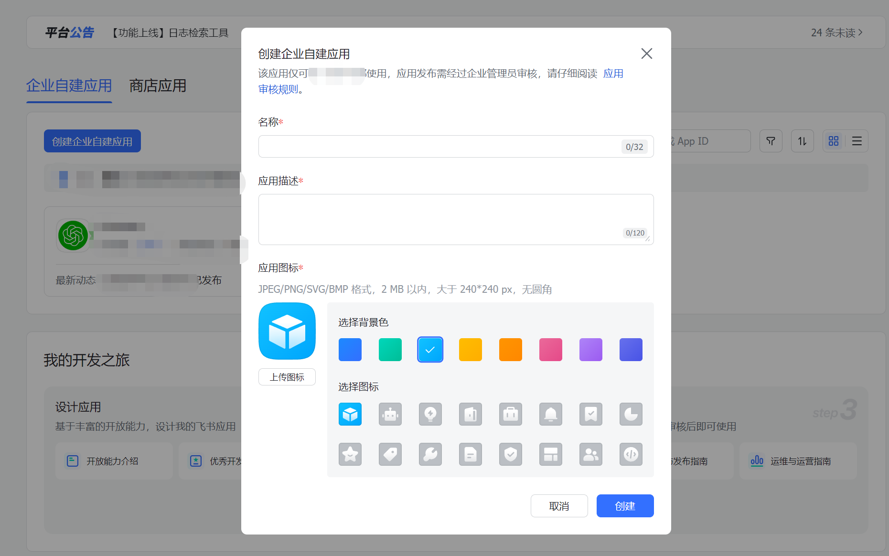
- 添加应用能力-->添加机器人 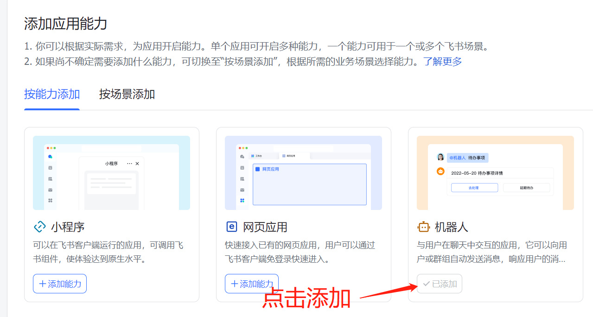
- 点击权限管理,添加以下四个权限 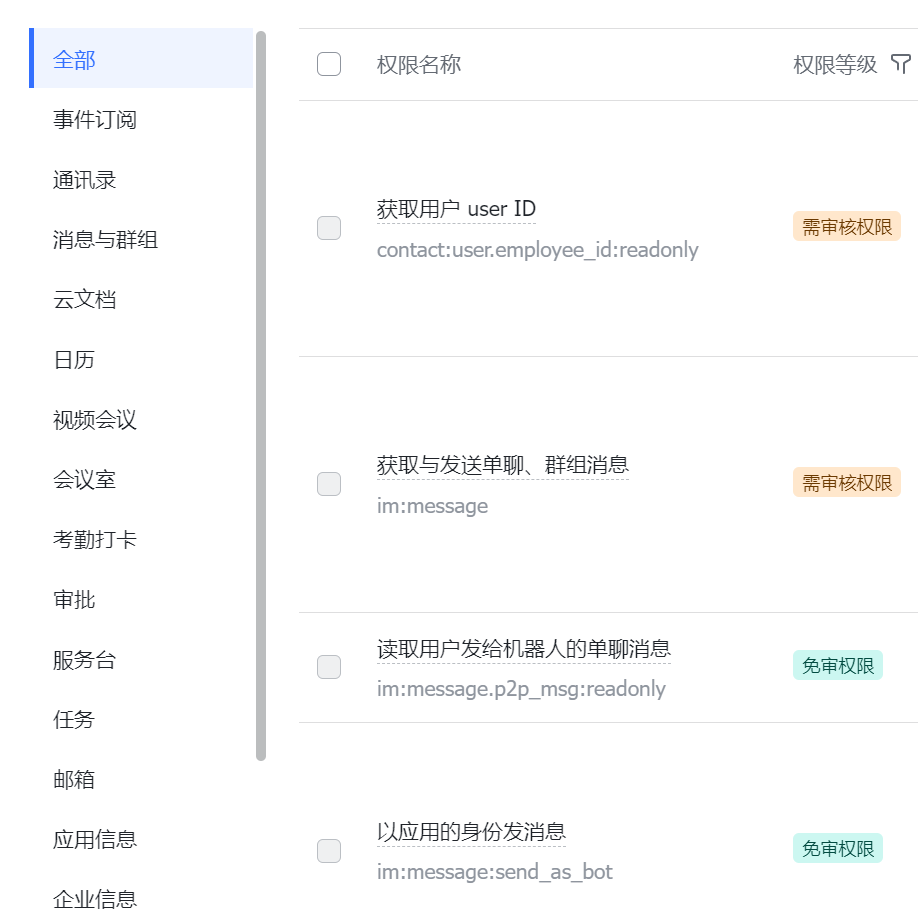
- 点击事件订阅-->配置请求地址 飞书会向该请求地址发送POST请求验证Url(和企业微信的一个GET请求一个POST请求不同，所以在配置飞书地址时，需要先把FsGPTController中的另外一个POST注释掉) 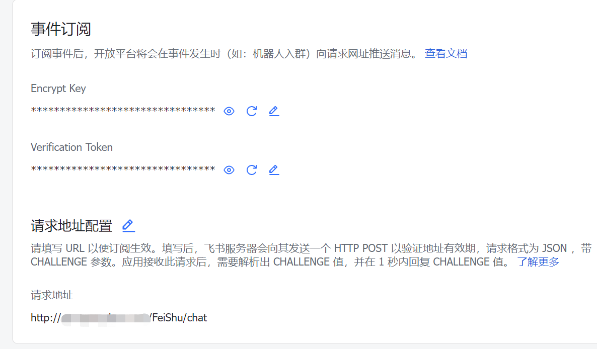

- 添加一下两个事件
    
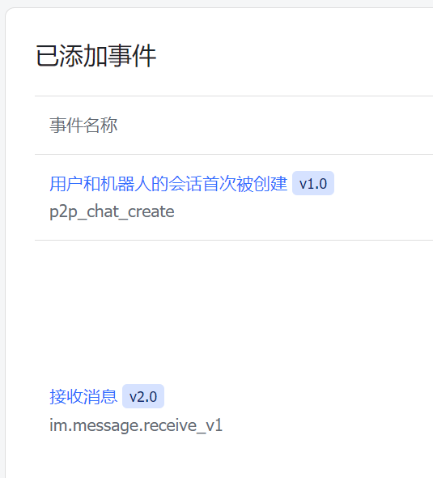

- 版本管理与发布-->创建版本-->申请线上发布

- 记录以下参数
    - App ID ----对应BaseConstants中的FsAppID---- 在自建应用的凭证与基础信息模块
    - App Secret ----对应BaseConstants中的FsAppSecret---- 在自建应用的凭证与基础信息模块
    - Encrypt Key ----对应BaseConstants中的FsEncryptKey---- 在自建应用的事件订阅模块
    - Verification Token ----对应BaseConstants中的FsVerificationToken---- 在自建应用的事件订阅模块

### 5.2 代码介绍
- FsGPTController  参考文档：[接收并处理事件](https://open.feishu.cn/document/ukTMukTMukTM/uYDNxYjL2QTM24iN0EjN/event-subscription-configure-/encrypt-key-encryption-configuration-case#679e4309)
  ```java
    //配置url时临时使用，后续删除或注释掉
    // @PostMapping("/chat")
    private JSONObject verify(@RequestBody String encryptString) throws Exception {
        JSONObject object = JSONObject.parseObject(encryptString);
        String encrypt = object.getString("encrypt");
        //解密 飞书官方提供了工具类(放在该项目中的util.fs包下)
        FsMsgcrypt decrypt = new FsMsgcrypt(BaseConstants.FsEncryptKey);
        String result = decrypt.decrypt(encrypt);
        JSONObject jsonObject = JSON.parseObject(result);

        //验证token
        String token = jsonObject.getString("token");
        if (!BaseConstants.FsVerificationToken.equals(token)) {
            log.error("FeiShu verify error,token invalid,token={}", token);
            return null;
        }

        String challengeString = jsonObject.getString("challenge");
        log.info("verifyurl challenge: " + challengeString);
        JSONObject jsonResult = new JSONObject();
        jsonResult.put("challenge", challengeString);
        return jsonResult;

    }

    //配置url时需要注释掉
    @PostMapping("/chat")
    private String chat(@RequestBody String encryptString,
                        HttpServletRequest request) throws Exception {
        log.info("------飞书------:chat方法被调用");
        String requestId = request.getHeader("x-request-id");
        String nonce = request.getHeader("x-lark-request-nonce");
        String timestamp = request.getHeader("x-lark-request-timestamp");
        String signature = request.getHeader("x-lark-signature");

        //判断是否重复请求,这里我使用了请求头中的“x-request-id”去重，是一串uuid
        //飞书官方文档有这样一句话：应用收到 HTTP POST 请求后，需要在 3 秒内以 HTTP 200 状态码响应该请求。否则飞书开放平台认为本次推送失败，并以 15秒、5分钟、1小时、6小时 的间隔重新推送事件，最多重试 4 次。从上述描述可以看出，事件重发的最长时间窗口约为 7.1 小时，请检查和处理在 7.1 小时内的重复事件。

        //间隔太长了好烦！！！
        String requestIdCache = CacheHelper.getRequestFsCache(requestId);

        if (StringUtils.isNotEmpty(requestIdCache)) {
            log.error("------飞书------:重复请求");
            //理论上第二次重新推送事件的时候，飞书会接收到200的状态码，这时候可以删除缓存(但偶有超过五分钟后重新推送的情况，所以这里我保留了15分钟的缓存)
            return "fail";
        } else {
            CacheHelper.setRequestFsCache(requestId, requestId);
        }

        //验证签名
        StringBuilder sb = new StringBuilder();
        sb.append(timestamp).append(nonce).append(BaseConstants.FsEncryptKey).append(encryptString);
        MessageDigest alg = MessageDigest.getInstance("SHA-256");
        String sign = Hex.encodeHexString(alg.digest(sb.toString().getBytes()));
        if (!sign.equals(signature)) {
            log.error("------飞书------:签名验证失败");
            return "fail";
        }

        //解密
        JSONObject object = JSONObject.parseObject(encryptString);
        String encrypt = object.getString("encrypt");
        FsMsgcrypt decrypt = new FsMsgcrypt(BaseConstants.FsEncryptKey);
        String decryptResult = decrypt.decrypt(encrypt);


        FsUserSendMsg fsUserSendMsg = JSON.parseObject(decryptResult, FsUserSendMsg.class);
        String content = fsUserSendMsg.getEvent().getMessage().getContent();
        String userId = fsUserSendMsg.getEvent().getSender().getSender_id().getUser_id();

        String fromUser = "FeiShu" + userId;

        log.info("------飞书------:调用openai");
        // 调openai
        String result = chatGPTService.sendMsgToGPT(fromUser, content);
        log.info("------飞书------:result: " + result);
        //给飞书发消息
        log.info("------飞书------:调用飞书api");
        String send = fsChatService.sendMsgToFs(result, userId);
        log.info("------飞书------:send: " + send);

        return "success";
    } 
  ``` 
- FsChatService 参考文档：[1.获取接口调用凭证](https://open.feishu.cn/document/ukTMukTMukTM/ukDNz4SO0MjL5QzM/auth-v3/auth/tenant_access_token_internal), [2.发送消息](https://open.feishu.cn/document/uAjLw4CM/ukTMukTMukTM/reference/im-v1/message/create)
   ```java
   /**
     * 将消息发送到飞书用户
     *
     * @param result chatgpt的返回结果
     * @param toUser 飞书用户
     * @return
     */
    public String sendMsgToFs(String result, String toUser) {
      //从缓存中提取
        String accessToken = CacheHelper.getToken("FsAccessToken");
        if (StringUtils.isEmpty(accessToken)) {
            accessToken = getFsAccessToken();
        }

        if ("获取token失败".equals(accessToken)) {
            return "获取飞书调用接口凭证失败";
        }

        //请求头
        Map<String, String> mapHeaders = new HashMap<>();
        mapHeaders.put("Content-Type", "application/json; charset=utf-8");
        mapHeaders.put("Authorization", "Bearer " + accessToken);
        //url
        String url = "https://open.feishu.cn/open-apis/im/v1/messages?receive_id_type=user_id";
        //body
        JSONObject params = new JSONObject();
        params.put("uuid", UUID.randomUUID().toString());
        params.put("msg_type", "text");
        params.put("receive_id", toUser);
        JSONObject content = new JSONObject();
        content.put("text", result);
        params.put("content", content.toJSONString());


        HttpResponse response = HttpRequest.post(url)
                .headerMap(mapHeaders, true)
                .body(params.toJSONString())
                .execute();

        JSONObject jsonObject = JSONObject.parseObject(response.body());

        Integer code = jsonObject.getInteger("code");
        if (code != 0) {
            log.info("发送消息失败，code:{},msg:{}", code, jsonObject.getString("msg"));
            return "发送消息失败";
        }

        return "success";
    }


    /**
     * 获取飞书调用接口凭证
     *
     * @return accessToken
     */
    public String getFsAccessToken() {
        String appid = BaseConstants.FsAppID;
        String appsecret = BaseConstants.FsAppSecret;
        //请求头
        Map<String, String> mapHeaders = new HashMap<>();
        mapHeaders.put("Content-Type", "application/json; charset=utf-8");

        //body
        JSONObject params = new JSONObject();
        params.put("app_id", appid);
        params.put("app_secret", appsecret);

        String url = "https://open.feishu.cn/open-apis/auth/v3/tenant_access_token/internal";

        HttpResponse response = HttpRequest.post(url)
                .headerMap(mapHeaders, true)
                .body(params.toJSONString())
                .execute();

        FsTokenResp fsTokenResp = JSONObject.parseObject(response.body(), FsTokenResp.class);

        Integer code = fsTokenResp.getCode();
        if (code != 0) {
            log.info("获取token失败，code:{},msg:{}", code, fsTokenResp.getMsg());
            return "获取token失败";
        }
        //将接口调用凭证存入缓存
        String accessToken = fsTokenResp.getTenant_access_token();
        CacheHelper.setToken("FsAccessToken", accessToken);
        return accessToken;
    }
  ```
## 6.公共代码
- CacheHelper 取自com.google.guava
  ```java
  public class CacheHelper {

    //接口调用凭证缓存
    private static Cache<String, String> tokenCache;

    //用户连续对话缓存
    private static Cache<String, List<Message>> chatGPTCache;

    //保存飞书请求的唯一标识
    private static Cache<String,String> requestFsCache;

    //保存微信请求的唯一标识
    private static Cache<String,String> requestWxCache;


    static {
        tokenCache = CacheBuilder.newBuilder()
                .expireAfterWrite(120, TimeUnit.MINUTES)
                .build();

        chatGPTCache = CacheBuilder.newBuilder()
                .expireAfterWrite(10, TimeUnit.MINUTES)
                .build();

        //飞书的请求间隔为7.1小时，即426分钟，烦
        requestFsCache = CacheBuilder.newBuilder()
                .expireAfterWrite(427, TimeUnit.MINUTES)
                .build();

        //企业微信连续请求三次就不请求了，真好
        requestWxCache = CacheBuilder.newBuilder()
                .expireAfterWrite(10, TimeUnit.MINUTES)
                .build();
    }

    public static void setToken(String key, String value) {
        tokenCache.put(key, value);
    }

    public static String getToken(String key) {
        return tokenCache.getIfPresent(key);
    }

    public static void setRequestFsCache(String key, String value) {requestFsCache.put(key, value);}

    public static String getRequestFsCache(String key) {return requestFsCache.getIfPresent(key);}

    public static void setRequestWxCache(String key, String value) {requestWxCache.put(key, value);}

    public static String getRequestWxCache(String key) {return requestWxCache.getIfPresent(key);}

    public static void setGPTCache(String username, List<Message> gptMessages) {
        chatGPTCache.put(username, gptMessages);
    }

    public static List<Message> getGPTCache(String username) {
        List<Message> gptMessages = chatGPTCache.getIfPresent(username);
        if (CollectionUtils.isEmpty(gptMessages)) {
            return Lists.newArrayList();
        }
        return gptMessages;
    }

    //清空缓存
    public static void setUserChatFlowClose(String username) {
        chatGPTCache.invalidate(username);
    }


  }
  ```
- BaseConstants 存放了一些配置参数(或者放在application.yml里)

- ChatGPTService 参考文档: [创建会话](https://platform.openai.com/docs/api-reference/chat)
  ```java
      /**
     * 将消息发送到chatgpt
     *
     * @param fromUser 用户
     * @param content  消息
     * @return
     */
    public String sendMsgToGPT(String fromUser, String content) {
        //请求头
        Map<String, String> mapHeaders = new HashMap<>();
        mapHeaders.put("Content-Type", "application/json; charset=UTF-8");
        mapHeaders.put("Authorization", "Bearer " + BaseConstants.api_key);
        //请求体
        CompletionReq completionReq = new CompletionReq();
        //消息列表
        List<Message> Messages = CacheHelper.getGPTCache(fromUser);

        Message Message = new Message();
        Message.setRole("user");
        Message.setContent(content);
        Messages.add(Message);


        completionReq.setMessages(Messages);
        //模型
        completionReq.setModel(BaseConstants.model);
        //最大token
        completionReq.setMax_tokens(BaseConstants.max_tokens);


        //url
        String url = "https://api.openai.com/v1/chat/completions";

        HttpResponse response = HttpRequest.post(url)
                .headerMap(mapHeaders, true)
                .body(JSONObject.toJSONString(completionReq))
                .execute();

        int code = response.getStatus();

        if (code == 401) {
            log.error(">>>>completions.response:{}", response.body());
            return "未授权的操作!ApiKey错误";

        }


        if (response.getStatus() != 200) {
            log.error(">>>>completions.response:{}", response.body());

            ErrorResp error = JSON.parseObject(response.body(), ErrorResp.class);
            return error.getError().getMessage();
        }


        try {
            CompletionResp completionResp = JSON.parseObject(response.body(), CompletionResp.class);

            List<Choices> choices = completionResp.getChoices();
            String result = choices.stream().map(Choices::getContent).collect(Collectors.joining(""));
            //由于chatgpt连续对话的原理是每次发送所有聊天记录，需要在本地保存一个聊天记录队列
            //队列size大于BaseConstants.max_chat_count时会清空队列
            if (Messages.size() >= BaseConstants.max_chat_count) {
                CacheHelper.setUserChatFlowClose(fromUser);
                log.info(">>>>用户{}连续对话超过{}次，自动关闭", fromUser, BaseConstants.max_chat_count);
                return result+ "\n\n连续对话次过多，已刷新对话";
            } else {
                Message asistantMsg = new Message();
                asistantMsg.setRole("assistant");
                asistantMsg.setContent(result);
                Messages.add(asistantMsg);
                CacheHelper.setGPTCache(fromUser, Messages);
            }
            return result;
        } catch (Exception e) {
            return "JSON格式解析失败";
        }
    }
    ```


## 7.作者留言
- README.md中没有涵盖项目开发的所有过程，如服务器具体配置步骤、域名解析等等，这些需要大家自行搜索。
- 如果想要彻底理解项目代码，建议大家去读透开发文档，项目开发本身就是出现问题，寻找文档，解决问题的过程。
- 为了方便部署，没有采用第三方工具如redis等工具，后续可能会考虑。
- 因为开发周期较短，可能代码写的不是很好，还有很多需要改进的地方，或者存在潜在的BUG，欢迎大家批评指正。
- 邮箱: ip1163825462@outlook.com


